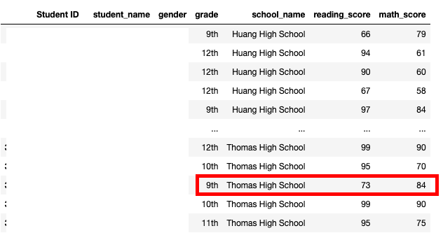
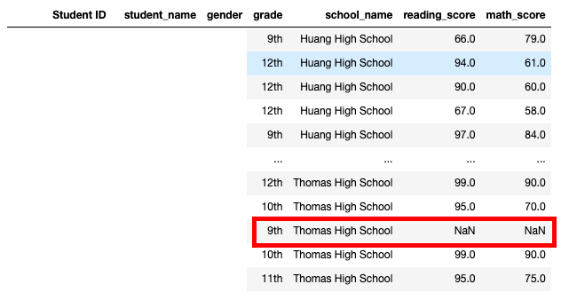
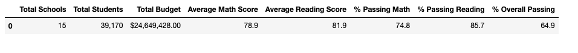
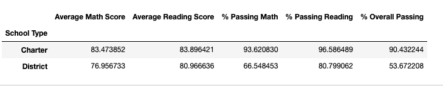
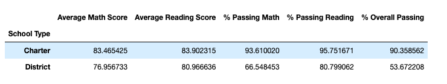

# School District Analysis

## Background
Maria, chief data scientist is responsible for analysing district schools tests data for students performance trends and patterns. These insights are used for informed decisions at the school and district levels. For this we are looking at the dataset to get an understanding of student fundings and standardised test performance scores for math and reading. The information presented will determine school budgets and priorities decisions.

Note: FERPA 1974 protects students' privacy.

## Overview of Project
Here is the list of deliverables for the analysis of the school district:

* A high-level snapshot of the district's key metrics, presented in a table format
* An overview of the key metrics for each school, presented in a table format

Tables presenting each of the following metrics:
* Top 5 and bottom 5 performing schools, based on the overall passing rate
* The average math score received by students in each grade level at each school
* The average reading score received by students in each grade level at each school
* School performance based on the budget per student
* School performance based on the school size
* School performance based on the type of school

The school board has notified Maria and her supervisor that the students_complete.csv file shows evidence of academic dishonesty; specifically, reading and math grades for Thomas High School ninth graders appear to have been altered. Although the school board does not know the full extent of the academic dishonesty, they want to uphold state-testing standards and have turned to Maria for help. She has asked me to replace the math and reading scores for Thomas High School with NaNs while keeping the rest of the data intact. Once I have replaced the math and reading scores, Maria would like me to repeat the school district analysis that I did in this module and write up a report to describe how these changes affected the overall analysis.


### Purpose

Results: Using bulleted lists and images of DataFrames as support, address the following questions.

How is the district summary affected?
How is the school summary affected?
How does replacing the ninth graders’ math and reading scores affect Thomas High School’s performance relative to the other schools?
How does replacing the ninth-grade scores affect the following:
Math and reading scores by grade
Scores by school spending
Scores by school size
Scores by school type
Summary: Summarize four changes in the updated school district analysis after reading and math scores for the ninth grade at Thomas High School have been replaced with NaNs.


The written analysis has the following:

Overview of the school district analysis:

The purpose of this analysis is well defined (3 pt).
Results:

There is a bulleted list that addresses how each of the seven school district metrics was affected by the changes in the data (10 pt).
Summary:

There is a statement summarizing four changes to the school district analysis after reading and math scores have been replaced (5 pt).

## Analysis And Challenges

## Methodology: Analytics Paradigm

#### 1. Decomposing the Ask
The students_complete.csv file shows evidence of academic dishonesty; specifically, reading and math grades for Thomas High School ninth graders appear to have been altered.

#### 2. Identify the Datasource
students_complete.csv & schools_complete.csv

#### 3. Define Strategy & Metrics
Change Thomas High School 9th graders reading & math scores to NaN so we do not calculate any scores for Thomas High School 9th graders.
Find the total of Thomas High School 9th graders.

After we've cleaned up the student data above, recalculate for:
* School district analysis
* High & low performing schools_complete
* Math & reading scores by grade for each school_data_to_load
* Scores by school spending
* Scores by school type


#### 4. Data Retrieval Plan
Read CSV with pandas
```
school_data_to_load = "resources/schools_complete.csv"
student_data_to_load = "resources/students_complete.csv"
school_data_df = pd.read_csv(school_data_to_load)
student_data_df = pd.read_csv(student_data_to_load)
```

#### 5. Assemble & Clean the Data
* Cleaning student names by removing prefixes & suffixes
* Cleaning all Thomas High School 9th grades student scores by making them NaN

#### 6. Analyse for Trends
Compare results for all analysis from before student scores cleaning and after student scores cleaning.

#### 7. Acknowledging Limitations
* Self limitations with pandas, therefore reference Stackover Flow multiple times.

#### 8. Making the Call:
The "Proper" Conclusion is indicated below on [Summary](#summary)

## Analysis

First, start by nullifying the both the scores for Thomas High School 9th graders.
>Old Thomas High School 9th Graders Scores



>New Thomas High School 9th Graders Scores



When we check the student data, we will confirm that there are 416 students with no scores and that corresponds to the total students from Thomas High School in 9th grade. See the code below for reference.

```
#  Step 4. Check the student data for NaN's.
na_student_data_df = student_data_df.copy()
na_student_data_df[student_data_df.isna().any(axis=1)]
```

###School Summary

>District Summary with Thomas High School 9th Graders Scores


>District Summary without Thomas High School 9th Graders Scores



When we compare the overall summary for all 15 schools in this district, we can see the overall  


>School Type Summary with Thomas High School 9th Graders Scores



>School Type Summary without Thomas High School 9th Graders Scores



## Summary

## Appendix
