# School District Analysis

## Background
Maria, chief data scientist is responsible for analysing district schools tests data for students performance trends and patterns. These insights are used for informed decisions at the school and district levels. For this we are looking at the dataset to get an understanding of student fundings and standardised test performance scores for math and reading. The information presented will determine school budgets and priorities decisions.

Note: FERPA 1974 protects students' privacy.

## Overview of Project
Deliverables for the analysis of the school district:
* A high-level snapshot of the district's key metrics, presented in a table format
* An overview of the key metrics for each school, presented in a table format

Tables presenting each of the following metrics:
* Top 5 and bottom 5 performing schools, based on the overall passing rate
* The average math score received by students in each grade level at each school
* The average reading score received by students in each grade level at each school
* School performance based on the budget per student
* School performance based on the school size
* School performance based on the type of school

The school board has notified Maria and her supervisor that the students_complete.csv file shows evidence of academic dishonesty; specifically, reading and math grades for Thomas High School ninth graders appear to have been altered. Although the school board does not know the full extent of the academic dishonesty, they want to uphold state-testing standards and have turned to Maria for help. She has asked me to replace the math and reading scores for Thomas High School with NaNs while keeping the rest of the data intact. Once I have replaced the math and reading scores, Maria would like me to repeat the school district analysis that I did in this module and write up a report to describe how these changes affected the overall analysis.


### Purpose

Results:
How is the district summary affected?
How is the school summary affected?
How does replacing the ninth graders’ math and reading scores affect Thomas High School’s performance relative to the other schools?
How does replacing the ninth-grade scores affect the following:
Math and reading scores by grade
Scores by school spending
Scores by school size
Scores by school type

Summarize four changes in the updated school district analysis after reading and math scores for the ninth grade at Thomas High School have been replaced with NaNs.

## Analysis And Challenges

## Methodology: Analytics Paradigm

#### 1. Decomposing the Ask
The students_complete.csv file shows evidence of academic dishonesty; specifically, reading and math grades for Thomas High School ninth graders appear to have been altered. Uphold state-testing standards by keeping only Thomas High School scores for 10th to 12th graders.

#### 2. Identify the Datasource
* students_complete.csv
* schools_complete.csv

#### 3. Define Strategy & Metrics
**Resource:** Python 3.6, Anaconda, Jupyter Notebook

1. Change Thomas High School 9th graders reading & math scores to NaN so we do not calculate any scores for Thomas High School 9th graders.
2. Recalculate the different scores for Thomas High School by only calculating the scores for 10th to 12th graders.
3. Make sure to keep Thomas High School total students (9th to 12th) for budget analysis.

After we've cleaned up the student data above, recalculate for:
* School district analysis
* High & low performing schools_complete
* Math & reading scores by grade for each school_data_to_load
* Scores by school spending
* Scores by school type


#### 4. Data Retrieval Plan
Read CSV with pandas
```
school_data_to_load = "resources/schools_complete.csv"
student_data_to_load = "resources/students_complete.csv"
school_data_df = pd.read_csv(school_data_to_load)
student_data_df = pd.read_csv(student_data_to_load)
```

#### 5. Assemble & Clean the Data
* Cleaning student names by removing prefixes & suffixes
* Cleaning all Thomas High School 9th grades student scores by making them NaN

#### 6. Analyse for Trends
Compare results for all analysis from before student scores cleaning and after student scores cleaning.

#### 7. Acknowledging Limitations
* Self limitations with pandas, therefore reference Stackover Flow multiple times.

#### 8. Making the Call:
The "Proper" Conclusion is indicated below on [Summary](#summary)

## Analysis

First, start by nullifying the both the scores for Thomas High School 9th graders.

>Old Thomas High School 9th Graders Scores


>New Thomas High School 9th Graders Scores


When we check the student data, we will confirm that there are _**416**_ students with no scores and that corresponds to the total students from Thomas High School in 9th grade. See the code below for reference.

```
#  Step 4. Check the student data for NaN's.
na_student_data_df = student_data_df.copy()
na_student_data_df[student_data_df.isna().any(axis=1)]
```

### School Summary

##### Thomas High School Comparison With and Without 9th Grader's Scores
>Thomas High School with 9th Graders Scores

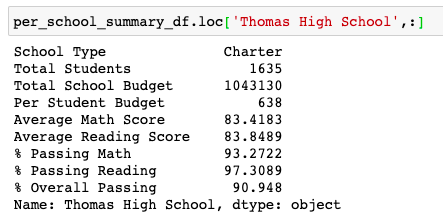

>Thomas High School WITHOUT 9th Graders Scores

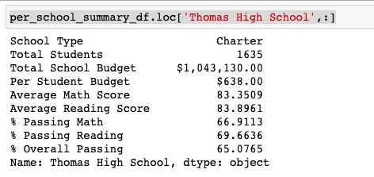

The most significant differences in the academic dishonesty is the in the percentage passing rate for Thomas High School. After we've removed 9th graders' scores from the calculation:
* Math scores fell from 93.27%% to 66.91%
* Reading scores fell from 97.3% to 69.66%
* Overall scores fell from 90.94% to 65.07%

##### District Summary Comparison With and Without Thomas High School 9th Grader's Scores
>District Summary with Thomas High School 9th Graders Scores

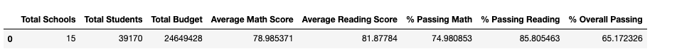

>District Summary WITHOUT Thomas High School 9th Graders Scores


When we compare the overall summary for all 15 schools in this district, we can see the overall passing fell from 65.17% to 64.9%.
* Math scores fell from 74.98% to 74.8%
* Reading scores fell from 85.8% to 85.7%

##### Top Schools Comparison With and Without Thomas High School 9th Grader's Scores
>Top Schools with Thomas High School 9th Graders Scores

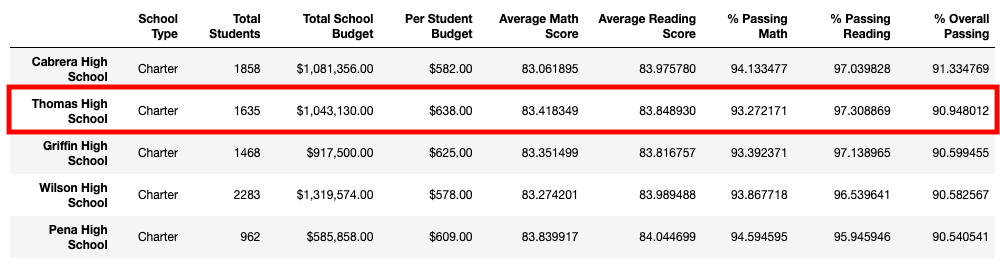

>Top Schools WITHOUT Thomas High School 9th Graders Scores

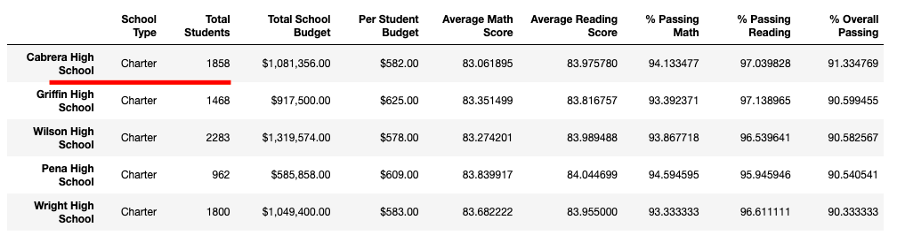

As can be seen from the figures above, Thomas High School was at top 2 with the old data. However, after Thomas High School's 9th graders' scores was removed, Thomas High School is not placed in top 5 schools anymore.

There is no change to the bottom 5 schools.

##### Math & Reading Scores by Grade for Every School Without Thomas High School 9th Grader's Scores

>Average Math Scores by School WITHOUT Thomas High School 9th Graders Scores

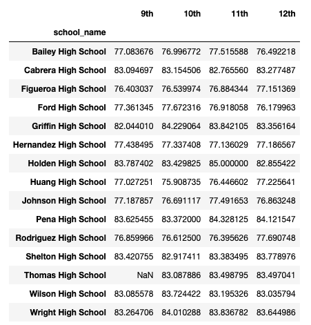

>Average Reading Scores by School WITHOUT Thomas High School 9th Graders Scores

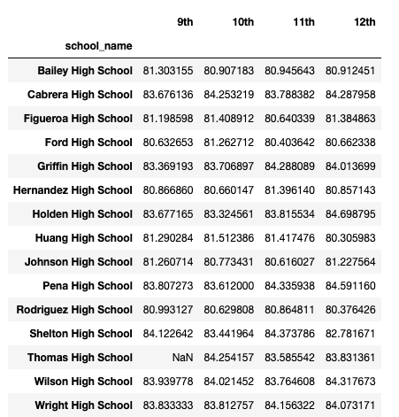

##### Scores by School Spending Comparison With and Without Thomas High School 9th Grader's Scores

>Scores by School Spending with Thomas High School 9th Graders Scores

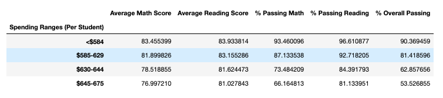

>Scores by School Spending WITHOUT Thomas High School 9th Graders Scores

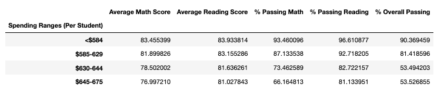

As Thomas High School budget falls between $630-$644; we can see the changes for overall scores in this category only.
* The overall passing fell from 62.85% to 53.49%.
* Math scores fell from 73.48% to 73.46%
* Reading scores fell from 84.39% to 82.72%

No changes in other budget categories.

##### Scores by School Size Comparison With and Without Thomas High School 9th Grader's Scores

>Scores by School Size with Thomas High School 9th Graders Scores

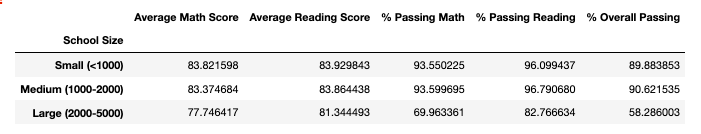

>Scores by School Size WITHOUT Thomas High School 9th Graders Scores

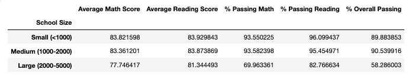

As Thomas High School size is Medium(1000-2000); we can see the changes for overall scores in this category only.
* The overall passing fell from 90.62% to 90.53%
* Math scores fell from 93.59% to 93.58%
* Reading scores fell from 96.79% to 95.45%

No changes in other budget categories.

##### Scores by School Size Comparison With and Without Thomas High School 9th Grader's Scores

>School Type Summary with Thomas High School 9th Graders Scores


>School Type Summary WITHOUT Thomas High School 9th Graders Scores


As Thomas High School size is Charter; we can see the changes for overall scores in this category only.
* The overall passing fell from 90.62% to 90.53%
* Math scores fell from 93.59% to 93.58%
* Reading scores fell from 96.79% to 95.45%

No changes in other budget categories.

## Summary
From the analysis above, the most significant differences are due to Thomas High Schools' academic dishonesty are:

1. Thomas High School overall scores fell from _**90.94% to 65.07%**_. This means _**25.9%**_ discrepancy.
1. Thomas High School math scores fell from _**93.27%% to 66.91%**_. This means _**26.36%**_ discrepancy.
1. Thomas High School reading scores fell from _**97.3% to 69.66%**_. This means _**27.64%**_ discrepancy.

From the scores above, Thomas High School went from top 5 schools (2nd ranking) to _**no ranking.**_

Overall scores for 15 schools when it comes to comparing budget size, school size and school type; Thomas High School's 9th graders score only caused a _**drop of maximum 1%**_ in the new analysis.

While we do not know for certain if all or only some of the 9th graders' scores are altered, we had to drop all the scores for 9th graders. This is a drastic move and should be used only as a last resort.

## Appendix
